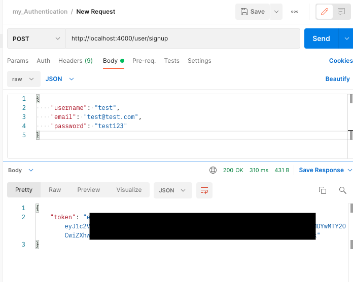
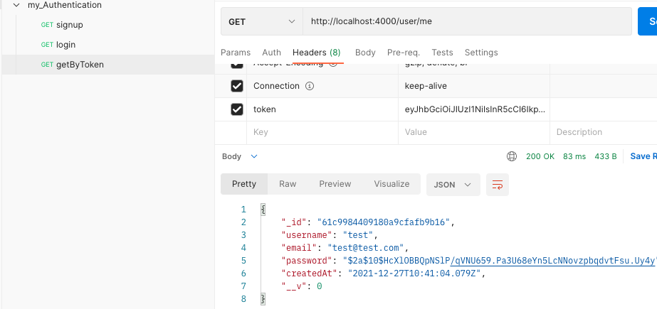

## Mern Stack Guide for making a production ready authentication API utilizing [Json Web Tokens](https://jwt.io/)

Hello everyone! This is about the shortest, most lightweight guide i could come up with on making a fullstack application utilizing the MERN stack. [What is MERN? Why use MERN?](https://www.mongodb.com/mern-stack)

Almost every app you build will deal with authentication and this guide will give you everything you need to handle authentication with the MERN stack. Most courses you take include how to handle authentication but are 40 hours long so i really wanted to cut out as much abstraction as possible. Feel free to clone, fork, modify this app, make it your own. I insist. For repo [Click Here](https://github.com/gregdbanks/my_authentication_2.0)

<span style="text-align: center;">


</span>

### System Requirements

- [Node](https://nodejs.dev/learn/how-to-install-nodejs)
- [NPM](https://docs.npmjs.com/cli/v7/configuring-npm/install)
- [Git Bash](https://www.gitkraken.com/blog/what-is-git-bash)

### What is JWT and why is it useful?

JWT is useful for Authorization and Information exchange. Can be sent via URL/ Post request/HTTP Header which makes it fast for transmission and usable. It contains the details of user (not session id in cookies like traditional request) so , :drum: :drum: :drum: , NO need to query database to get user details.

### What to Know?

You should know the basics of javascript and node, so this guide assumes both.

We will be using MongoDB Atlas Cloud Database to store our users. [For more info...](https://docs.atlas.mongodb.com/)

### Instructions for MongoDB Atlas (this is where you get your connection string needed later)

1. Visit [Official Docs](https://docs.atlas.mongodb.com/) , After signing up, click on `+ New Project`
2. Name your project
3. Click `Create Project`
4. Click `Build a Database`
5. Select FREE tier and click `Create`
6. Choose a cloud provider, I chose AWS, but any will do
7. Choose a region, any
8. Scroll to the bottom and click `Create Cluster` (could take several minutes)
9. Create a User, entering in a username and password and then clicking `Create User`
10. Select where you would like to connect from, select local, and then click `Add My Current Ip Address`
11. Click `Finish and Close` at the bottom of page
12. In Database Deployments Click the `Connect` button next to your cluster name
13. Click `Connect your application`, here is where you can get your connection string. :smile:

---

### NPM packages we will be using

- [express](http://expressjs.com/)

- [express-validator](https://express-validator.github.io/docs/)

- [bcryptjs](https://www.npmjs.com/package/bcrypt)

- [JWT](https://jwt.io/)

- [mongoose](https://mongoosejs.com/docs/)

- [dotenv](https://www.npmjs.com/package/dotenv)

### Initiate your project

1. Create a new folder call it 'my-authentication'
2. Pull up terminal/git bash and execute this statement below

```
npm init
```

3. Npm init will ask basic info, fill out accordingly
4. Install all packages mentioned previously

```
npm install express express-validator bcryptjs jsonwebtoken mongoose dotenv --save
```

5. Now create a file `index.js` at the root adding this code

```js
const express = require("express");

const app = express();

// PORT
const PORT = process.env.PORT || 4000;

app.get("/", (req, res) => {
  res.json({ message: "API Working" });
});

app.listen(PORT, (req, res) => {
  console.log(`Server Started at PORT ${PORT}`);
});
```

6. Last step is to test, execute below, should see 'server will start at PORT 4000' in terminal

```
node index.js
```

### Create User Model

7. Create `.env` file at the root of your app, here is where you will store your connection string you recieved earlier doing the mongoDB Atlas section. Inside the `.env` file add this as well as your connection string:

```
DB_URI=yourSecretConnectionStringGoesHere
```

Warning, if your connection string password has special characters you will need it encoded for more info you can get the encoded version of your password [here](https://www.w3schools.com/html/html_urlencode.asp) by entering it in the `Try It Yourself` input.

8. Create a `config` folder and inside create a `db.js`, add code below

```js
const mongoose = require("mongoose");
require("dotenv").config();

// Replace this with your MONGOURI.
const MONGOURI = process.env.DB_URI;

const InitiateMongoServer = async () => {
  try {
    await mongoose.connect(MONGOURI, {
      useNewUrlParser: true,
    });
    console.log("Connected to DB !!");
  } catch (e) {
    console.log(e);
    throw e;
  }
};

module.exports = InitiateMongoServer;
```

> Notice InitiateMongoServer is an `async` function, We will be using [async await](https://javascript.info/async-await) to work with promises. The word `async` before a function means one simple thing: a function always returns a promise. Other values are wrapped in a resolved promise automatically.

9. Test by running`node index.js` in your terminal, expect server to connect
10. Create a `model` folder and inside create a `User.js` (Capitalized), add code below

```js
const mongoose = require("mongoose");

const UserSchema = mongoose.Schema({
  username: {
    type: String,
    required: true,
  },
  email: {
    type: String,
    required: true,
  },
  password: {
    type: String,
    required: true,
  },
  createdAt: {
    type: Date,
    default: Date.now(),
  },
});

// export model user with UserSchema
module.exports = mongoose.model("user", UserSchema);
```

11. Update `index.js` adding code below

```js
const express = require("express");
const bodyParser = require("body-parser");
const InitiateMongoServer = require("./config/db");

// Initiate Mongo Server
InitiateMongoServer();

const app = express();

// PORT
const PORT = process.env.PORT || 4000;

// Middleware
app.use(bodyParser.json());

app.get("/", (req, res) => {
  res.json({ message: "API Working" });
});

app.listen(PORT, (req, res) => {
  console.log(`Server Started at PORT ${PORT}`);
});
```

> Notice we add [body-parser](https://www.npmjs.com/package/body-parser) which we will use to parse incoming request bodies.

### Make Route for User signup

If new to routing click [here](https://expressjs.com/en/starter/basic-routing.html) to learn basics

12. Create a `routes` folder and inside create a `user.js` file. Add code below

```js
const express = require("express");
const { check, validationResult } = require("express-validator");
const bcrypt = require("bcryptjs");
const jwt = require("jsonwebtoken");
const router = express.Router();

const User = require("../model/User");

/**
 * @method - POST
 * @param - /signup
 * @description - User SignUp
 */

router.post(
  "/signup",
  [
    check("username", "Please Enter a Valid Username").not().isEmpty(),
    check("email", "Please enter a valid email").isEmail(),
    check("password", "Please enter a valid password").isLength({
      min: 6,
    }),
  ],
  async (req, res) => {
    const errors = validationResult(req);
    if (!errors.isEmpty()) {
      return res.status(400).json({
        errors: errors.array(),
      });
    }

    const { username, email, password } = req.body;
    try {
      let user = await User.findOne({
        email,
      });
      if (user) {
        return res.status(400).json({
          msg: "User Already Exists",
        });
      }

      user = new User({
        username,
        email,
        password,
      });

      const salt = await bcrypt.genSalt(10);
      user.password = await bcrypt.hash(password, salt);

      await user.save();

      const payload = {
        user: {
          id: user.id,
        },
      };

      jwt.sign(
        payload,
        "randomString",
        {
          expiresIn: 10000,
        },
        (err, token) => {
          if (err) throw err;
          res.status(200).json({
            token,
          });
        }
      );
    } catch (err) {
      console.log(err.message);
      res.status(500).send("Error in Saving");
    }
  }
);

module.exports = router;
```

This will be a post request using [express-validator](https://express-validator.github.io/docs/) for our signup form validation, [bcrypt](https://www.npmjs.com/package/bcrypt) to hash our users password, and [jsonwebtoken](https://jwt.io/) to encrypt our payload.

13. Import in `index.js` like below and middleware to handles CORs

```js
const express = require("express");
const bodyParser = require("body-parser");
const user = require("./routes/user"); //new addition
const InitiateMongoServer = require("./config/db");

// Initiate Mongo Server
InitiateMongoServer();

const app = express();

// PORT
const PORT = process.env.PORT || 4000;

// Middleware
app.use(bodyParser.json());
app.use(express.urlencoded({ extended: true }));
app.use(express.json());
app.use(function (req, res, next) {
  res.header("Access-Control-Allow-Origin", "http://localhost:3000"); // update to match the domain you will make the request from
  res.header(
    "Access-Control-Allow-Headers",
    "token, Origin, X-Requested-With, Content-Type, Accept"
  );
  next();
});

app.get("/", (req, res) => {
  res.json({ message: "API Working" });
});

/**
 * Router Middleware
 * Router - /user/*
 * Method - *
 */
app.use("/user", user);

app.listen(PORT, (req, res) => {
  console.log(`Server Started at PORT ${PORT}`);
});
```

14. Test using postman. If you don't have postman, click [here](https://learning.postman.com/docs/getting-started/installation-and-updates/) to install and setup. Expect results below.



### Make Route for User login.

15. Add code below to `user.js`

```js
router.post(
  "/login",
  [
    check("email", "Please enter a valid email").isEmail(),
    check("password", "Please enter a valid password").isLength({
      min: 6,
    }),
  ],
  async (req, res) => {
    const errors = validationResult(req);

    if (!errors.isEmpty()) {
      return res.status(400).json({
        errors: errors.array(),
      });
    }

    const { email, password } = req.body;
    try {
      let user = await User.findOne({
        email,
      });
      if (!user)
        return res.status(400).json({
          message: "User Not Exist",
        });

      const isMatch = await bcrypt.compare(password, user.password);
      if (!isMatch)
        return res.status(400).json({
          message: "Incorrect Password !",
        });

      const payload = {
        user: {
          id: user.id,
        },
      };

      jwt.sign(
        payload,
        "randomString",
        {
          expiresIn: 3600,
        },
        (err, token) => {
          if (err) throw err;
          res.status(200).json({
            token,
          });
        }
      );
    } catch (e) {
      console.error(e);
      res.status(500).json({
        message: "Server Error",
      });
    }
  }
);
```

16. Test using postman.

### Make Route to Get User.

17. We get tokens back from both user signup and user login, now lets add route to get a user via token. Add code below.

```js
const auth = require("../middleware/auth");
```

```js
router.get("/me", auth, async (req, res) => {
  try {
    // request.user is getting fetched from Middleware after token authentication
    const user = await User.findById(req.user.id);
    res.json(user);
  } catch (e) {
    res.send({ message: "Error in Fetching user" });
  }
});
```

If you run the server you will get an error from the auth parameter so lets make that function.

18. Create a `middleware` folder and inside create a `auth.js` adding the code below.

```js
const jwt = require("jsonwebtoken");

module.exports = function (req, res, next) {
  const token = req.header("token");
  if (!token) return res.status(401).json({ message: "Auth Error" });

  try {
    const decoded = jwt.verify(token, "randomString");
    req.user = decoded.user;
    next();
  } catch (e) {
    console.error(e);
    res.status(500).send({ message: "Invalid Token" });
  }
};
```

This function will be used to verify the users token

19. Test using postman. After signing up a user, try getting that same user passing the token you got from signup to the request header



### Make Controller file for user routes and clean up routes file

This folder will help us when we add more routes to this API keeping our route files shorter and more manageable

20. Create a `controllers` folder and add user.js, add route logic

```js
const { validationResult } = require("express-validator");
const bcrypt = require("bcryptjs");
const jwt = require("jsonwebtoken");

const User = require("../model/User");

exports.signUp = async (req, res) => {
  const errors = validationResult(req);
  if (!errors.isEmpty()) {
    return res.status(400).json({
      errors: errors.array(),
    });
  }

  const { username, email, password } = req.body;
  try {
    let user = await User.findOne({
      email,
    });
    if (user) {
      return res.status(400).json({
        msg: "User Already Exists",
      });
    }

    user = new User({
      username,
      email,
      password,
    });

    const salt = await bcrypt.genSalt(10);
    user.password = await bcrypt.hash(password, salt);

    await user.save();

    const payload = {
      user: {
        id: user.id,
      },
    };

    jwt.sign(
      payload,
      "randomString",
      {
        expiresIn: 10000,
      },
      (err, token) => {
        if (err) throw err;
        res.status(200).json({
          token,
        });
      }
    );
  } catch (err) {
    console.log(err.message);
    res.status(500).send("Error in Saving");
  }
};

exports.loginUser = async (req, res) => {
  const errors = validationResult(req);

  if (!errors.isEmpty()) {
    return res.status(400).json({
      errors: errors.array(),
    });
  }

  const { email, password } = req.body;
  try {
    let user = await User.findOne({
      email,
    });
    if (!user)
      return res.status(400).json({
        message: "User Not Exist",
      });

    const isMatch = await bcrypt.compare(password, user.password);
    if (!isMatch)
      return res.status(400).json({
        message: "Incorrect Password !",
      });

    const payload = {
      user: {
        id: user.id,
      },
    };

    jwt.sign(
      payload,
      "randomString",
      {
        expiresIn: 3600,
      },
      (err, token) => {
        if (err) throw err;
        res.status(200).json({
          token,
        });
      }
    );
  } catch (e) {
    console.error(e);
    res.status(500).json({
      message: "Server Error",
    });
  }
};

exports.getMe = async (req, res) => {
  try {
    // request.user is getting fetched from Middleware after token authentication
    const user = await User.findById(req.user.id);
    res.json(user);
  } catch (e) {
    res.send({ message: "Error in Fetching user" });
  }
};
```

21. Update `user.js` in routes folder to import controller logic

```js
const express = require("express");
const { check } = require("express-validator");

const auth = require("../middleware/auth");
const { signUp, loginUser, getMe } = require("../controllers/user");

const router = express.Router();

router.post(
  "/signup",
  [
    check("username", "Please Enter a Valid Username").not().isEmpty(),
    check("email", "Please enter a valid email").isEmail(),
    check("password", "Please enter a valid password").isLength({
      min: 6,
    }),
  ],
  signUp
);

router.post(
  "/login",
  [
    check("email", "Please enter a valid email").isEmail(),
    check("password", "Please enter a valid password").isLength({
      min: 6,
    }),
  ],
  loginUser
);

router.get("/me", auth, getMe);

module.exports = router;
```

### Adding frontend to our node app via React

We will be using [Create React App](https://github.com/facebook/create-react-app) for initiating our project. This Frontend react app will live at the root of your node app. Look below for file structure.

1. From your Node app root, run the command below in bash/terminal

```
npx create-react-app frontend
cd frontEnd
npm start
```

Should see the react logo in browser if successful

2. We are going to use bootstrap 4 in our project for ease, for more info [Click here](https://getbootstrap.com/docs/4.0/getting-started/introduction/). In your `public` folder replace `index.html` with code below.

```html
<!DOCTYPE html>
<html lang="en">
  <head>
    <meta charset="utf-8" />
    <link rel="icon" href="%PUBLIC_URL%/favicon.ico" />
    <meta name="viewport" content="width=device-width, initial-scale=1" />
    <meta name="theme-color" content="#000000" />
    <meta
      name="description"
      content="Web site created using create-react-app"
    />
    <link rel="apple-touch-icon" href="%PUBLIC_URL%/logo192.png" />
    <link rel="manifest" href="%PUBLIC_URL%/manifest.json" />
    <link rel="manifest" href="%PUBLIC_URL%/manifest.json" />
    <link
      rel="stylesheet"
      href="https://maxcdn.bootstrapcdn.com/bootstrap/4.0.0/css/bootstrap.min.css"
      integrity="sha384-Gn5384xqQ1aoWXA+058RXPxPg6fy4IWvTNh0E263XmFcJlSAwiGgFAW/dAiS6JXm"
      crossorigin="anonymous"
    />
    <title>React App</title>
  </head>
  <body>
    <div id="root"></div>
    <script
      src="https://code.jquery.com/jquery-3.2.1.slim.min.js"
      integrity="sha384-KJ3o2DKtIkvYIK3UENzmM7KCkRr/rE9/Qpg6aAZGJwFDMVNA/GpGFF93hXpG5KkN"
      crossorigin="anonymous"
    ></script>
    <script
      src="https://cdnjs.cloudflare.com/ajax/libs/popper.js/1.12.9/umd/popper.min.js"
      integrity="sha384-ApNbgh9B+Y1QKtv3Rn7W3mgPxhU9K/ScQsAP7hUibX39j7fakFPskvXusvfa0b4Q"
      crossorigin="anonymous"
    ></script>
    <script
      src="https://maxcdn.bootstrapcdn.com/bootstrap/4.0.0/js/bootstrap.min.js"
      integrity="sha384-JZR6Spejh4U02d8jOt6vLEHfe/JQGiRRSQQxSfFWpi1MquVdAyjUar5+76PVCmYl"
      crossorigin="anonymous"
    ></script>
  </body>
</html>
```

3. Create `components` folder within the `src` folder

4. Create `Header` folder inside `components`, inside create a `Header.js`

5. Using bootstrap's navbar, Add code below to `Header.js`

```js
import React from "react";
function Header() {
  return (
    <nav className="navbar navbar-dark bg-primary">
      <div className="row col-12 d-flex justify-content-center text-white">
        <span className="h3">Sign Up</span>
      </div>
    </nav>
  );
}
export default Header;
```

6. Import Header into `App.js` replacing its contents with the code below

```js
import React from "react";
import Header from "./components/Header/Header";

function App() {
  return (
    <div className="App">
      <Header />
    </div>
  );
}

export default App;
```

Now go look in browser, expect to see header.

We will be using react's useState hook, Assuming you have basic knowledge of react hooks, for more info [Click here](https://reactjs.org/docs/hooks-intro.html).

7. Create `SignUp` folder, inside create `SignUp.js`

```js
import React, { useState } from "react";

export default function SignUp(props) {
  const [user, setUser] = useState({
    username: "",
    email: "",
    password: "",
  });
  const handleChange = (e) => {
    const { id, value } = e.target;
    setUser((prevState) => ({
      ...prevState,
      [id]: value,
    }));
  };
  const handleSubmitClick = (e) => {
    e.preventDefault();
    if (user.password === user.confirmPassword) {
      sendDetailsToServer();
    } else {
      props.showError("Passwords do not match");
    }
  };
  return (
    <div className="card col-12 col-lg-4 login-card mt-2 hv-center">
      <form>
        <div className="form-group text-left">
          <label htmlFor="exampleInputUsername">Username</label>
          <input
            type="text"
            className="form-control"
            id="username"
            aria-describedby="usernameHelp"
            placeholder="Enter username"
            value={user.username}
            onChange={handleChange}
          />
        </div>
        <div className="form-group text-left">
          <label htmlFor="exampleInputEmail1">Email address</label>
          <input
            type="email"
            className="form-control"
            id="email"
            aria-describedby="emailHelp"
            placeholder="Enter email"
            value={user.email}
            onChange={handleChange}
          />
          <small id="emailHelp" className="form-text text-muted">
            We'll never share your email with anyone else.
          </small>
        </div>
        <div className="form-group text-left">
          <label htmlFor="exampleInputPassword1">Password</label>
          <input
            type="password"
            className="form-control"
            id="password"
            placeholder="Password"
            value={user.password}
            onChange={handleChange}
          />
        </div>
        <div className="form-group text-left">
          <label htmlFor="exampleInputPassword1">Confirm Password</label>
          <input
            type="password"
            className="form-control"
            id="confirmPassword"
            placeholder="Password"
            value={user.confirmPassword}
            onChange={handleChange}
          />
        </div>
        <button
          type="submit"
          className="btn btn-primary"
          onClick={handleSubmitClick}
        >
          Sign Up
        </button>
      </form>
    </div>
  );
}
```

We will be using `axios`, an npm module for async request. Click [here](https://www.npmjs.com/package/axios) for more info.

8. Run command below in terminal inside 'frontEnd' folder/dir.

```
npm i --save axios
```

9. Create `constants` folder at frontEnd `src` dir, Add `apiConstants.js` file adding code below

```js
export const API_BASE_URL = "http://localhost:4000/user/";
export const ACCESS_TOKEN_NAME = "login_access_token";
```

10. Add functions and imports below to `SignUp.js`

```js
import React, { useState } from "react";
import axios from "axios";
import { API_BASE_URL } from "../../constants/apiConstants";

export default function SignUp(props) {
  // ...
  const sendDetailsToServer = () => {
    if (user.email.length && user.password.length) {
      props.showError(null);
      const payload = {
        username: user.username,
        email: user.email,
        password: user.password,
      };
      axios
        .post(API_BASE_URL + "signup", payload)
        .then(function (response) {
          if (response.status === 200) {
            setUser((prevState) => ({
              ...prevState,
              successMessage:
                "Registration successful. Redirecting to home page..",
            }));
            redirectToHome();
            props.showError(null);
          } else {
            props.showError("Some error ocurred");
          }
        })
        .catch(function (error) {
          console.log(error);
        });
    } else {
      props.showError("Please enter valid username and password");
    }
  };
  const redirectToHome = () => {
    props.updateTitle("Home");
    props.history.push("/home");
  };
  // ...
}
```

11. Setup Client side routing by installing `react-router-dom`

For more info on Client side routing here is a good [article](https://alexmercedcoder.medium.com/understanding-client-side-routing-react-router-101-4a12a156a0cd) explaining it.

```
npm i react-router-dom@5.2.0
```

Add routing to `App.js` like code below

```js
import React, { useState } from "react";
import "./App.css";
import Header from "./components/Header/Header";
import SignUp from "./components/SignUp/SignUp";
import Alert from "./components/Alert/Alert";
import { BrowserRouter as Router, Switch, Route } from "react-router-dom";

function App() {
  const [title, updateTitle] = useState(null);
  const [errorMessage, updateErrorMessage] = useState(null);
  return (
    <Router>
      <div className="App">
        <Header title={title} />
        <div className="container d-flex align-items-center flex-column">
          <Switch>
            <Route path="/" exact={true}>
              <SignUp
                showError={updateErrorMessage}
                updateTitle={updateTitle}
              />
            </Route>
          </Switch>
          <Alert errorMessage={errorMessage} hideError={updateErrorMessage} />
        </div>
      </div>
    </Router>
  );
}

export default App;
```

12. Make `Alert` folder in components folder, adding `Alert.js` and `Alert.css`

```js
// Alert.js

import React, { useState, useEffect } from "react";
import "./Alert.css";

function Alert(props) {
  const [modalDisplay, toggleDisplay] = useState("none");

  const openModal = () => {
    toggleDisplay("block");
  };
  const closeModal = () => {
    toggleDisplay("none");
    props.hideError(null);
  };
  useEffect(() => {
    if (props.errorMessage !== null) {
      openModal();
    } else {
      closeModal();
    }
  });

  return (
    <div
      className={"alert alert-danger alert-dismissable mt-4"}
      role="alert"
      id="alertPopUp"
      style={{ display: modalDisplay }}
    >
      <div className="d-flex alertMessage">
        <span>{props.errorMessage}</span>
        <button
          type="button"
          className="close"
          aria-label="Close"
          onClick={() => closeModal()}
        >
          <span aria-hidden="true">&times;</span>
        </button>
      </div>
    </div>
  );
}

export default Alert;
```

Notice we pass props as an argument, this will come from the parent Component using this Alert component and we also use Reacts [useEffect](https://reactjs.org/docs/hooks-effect.html) hook which will wait for props to change from parent

</details>

13. Add code below to `Alert.css`

```css
/* ALert.css */
.alertMessage {
  min-width: 200px;
  justify-content: space-between;
}
```

Now that we have a sign up page, we need to be able to show a new user their home page after logging in. To protect that users info we can use session tokens.

14. Update sendDetailsToServer function in `SignUp.js` and add import from constants

```js
...
import { API_BASE_URL, ACCESS_TOKEN_NAME } from "../../constants/apiConstants";

...

  const sendDetailsToServer = () => {
    if (user.email.length && user.password.length) {
      props.showError(null);
      const payload = {
        username: user.username,
        email: user.email,
        password: user.password,
      };
      axios
        .post(API_BASE_URL + "signup", payload)
        .then(function (response) {
          if (response.status === 200) {
            setUser((prevState) => ({
              ...prevState,
              successMessage:
                "Registration successful. Redirecting to home page..",
            }));
            localStorage.setItem(ACCESS_TOKEN_NAME, response.data.token);
            redirectToHome();
            props.showError(null);
          } else {
            props.showError("Some error ocurred");
          }
        })
        .catch(function (error) {
          console.log(error);
        });
    } else {
      props.showError("Please enter valid username and password");
    }
  };
```

We use `localStorage.setItem` to store the token received from backend API to browser’s local storage.

15. Create `utils` folder at root of src, name it `PrivateRoute.js`, add code

```js
import React from "react";
import { Redirect, Route } from "react-router-dom";
import { ACCESS_TOKEN_NAME } from "../constants/apiConstants";

function PrivateRoute({ children, ...rest }) {
  return (
    <Route
      {...rest}
      render={({ location }) =>
        localStorage.getItem(ACCESS_TOKEN_NAME) ? (
          children
        ) : (
          <Redirect
            to={{
              pathname: "/login",
              state: { from: location },
            }}
          />
        )
      }
    />
  );
}

export default PrivateRoute;
```

Here we make a generic Route checking for our token which we will use later for our `Home` route.

16. Create `Login` component folder, then `Login.js` file.

```js
import React, { useState } from "react";
import axios from "axios";
import "./Login.css";
import { API_BASE_URL, ACCESS_TOKEN_NAME } from "../../constants/apiConstants";
import { withRouter } from "react-router-dom";

function Login(props) {
  const [state, setState] = useState({
    email: "",
    password: "",
    successMessage: null,
  });
  const handleChange = (e) => {
    const { id, value } = e.target;
    setState((prevState) => ({
      ...prevState,
      [id]: value,
    }));
  };

  const handleSubmitClick = (e) => {
    e.preventDefault();
    const payload = {
      email: state.email,
      password: state.password,
    };
    axios
      .post(API_BASE_URL + "login", payload)
      .then(function (response) {
        if (response.status === 200) {
          setState((prevState) => ({
            ...prevState,
            successMessage: "Login successful. Redirecting to home page..",
          }));
          localStorage.setItem(ACCESS_TOKEN_NAME, response.data.token);
          redirectToHome();
          props.showError(null);
        } else if (response.status === 204) {
          props.showError("Username and password do not match");
        } else {
          props.showError("Username does not exists");
        }
      })
      .catch(function (error) {
        console.log(error);
      });
  };
  const redirectToHome = () => {
    props.updateTitle("Home");
    props.history.push("/home");
  };
  const redirectToSignUp = () => {
    props.history.push("/signup");
    props.updateTitle("Sign Up");
  };
  return (
    <div className="card col-12 col-lg-4 login-card mt-2 hv-center">
      <form>
        <div className="form-group text-left">
          <label htmlFor="exampleInputEmail1">Email address</label>
          <input
            type="email"
            className="form-control"
            id="email"
            aria-describedby="emailHelp"
            placeholder="Enter email"
            value={state.email}
            onChange={handleChange}
          />
          <small id="emailHelp" className="form-text text-muted">
            We'll never share your email with anyone else.
          </small>
        </div>
        <div className="form-group text-left">
          <label htmlFor="exampleInputPassword1">Password</label>
          <input
            type="password"
            className="form-control"
            id="password"
            placeholder="Password"
            value={state.password}
            onChange={handleChange}
          />
        </div>
        <div className="form-check"></div>
        <button
          type="submit"
          className="btn btn-primary"
          onClick={handleSubmitClick}
        >
          Submit
        </button>
      </form>
      <div
        className="alert alert-success mt-2"
        style={{ display: state.successMessage ? "block" : "none" }}
        role="alert"
      >
        {state.successMessage}
      </div>
      <div className="registerMessage">
        <span>Dont have an account? </span>
        <span className="loginText" onClick={() => redirectToSignUp()}>
          Sign Up
        </span>
      </div>
    </div>
  );
}

export default withRouter(Login);
```

17. Create `Home` component folder, then `Home.js` file.

```js
import React, { useEffect } from "react";
import { withRouter } from "react-router-dom";
import axios from "axios";

import { ACCESS_TOKEN_NAME, API_BASE_URL } from "../../constants/apiConstants";

function Home(props) {
  useEffect(() => {
    axios
      .get(API_BASE_URL + "me", {
        headers: { token: localStorage.getItem(ACCESS_TOKEN_NAME) },
      })
      .then(function (response) {
        if (response.status !== 200) {
          redirectToLogin();
        }
      })
      .catch(function (error) {
        redirectToLogin();
      });
  });
  function redirectToLogin() {
    props.history.push("/login");
  }
  return <div className="mt-2">Home page only user should see.</div>;
}

export default withRouter(Home);
```

Notice our useEffect function checks to make sure our token is NOT expired by sending it in the headers to our API.

18. Now lets update our `App.js` file to include our home and login component routes.

```js
import React, { useState } from "react";
import "./App.css";

import PrivateRoute from "./utils/PrivateRoute";
import Header from "./components/Header/Header";
import Login from "./components/Login/Login";
import SignUp from "./components/SignUp/SignUp";
import Home from "./components/Home/Home";
import { BrowserRouter as Router, Switch, Route } from "react-router-dom";
import Alert from "./components/Alert/Alert";

function App() {
  const [title, updateTitle] = useState(null);
  const [errorMessage, updateErrorMessage] = useState(null);
  return (
    <Router>
      <div className="App">
        <Header title={title} />
        <div className="container d-flex align-items-center flex-column">
          <Switch>
            <Route path="/" exact={true}>
              <SignUp
                showError={updateErrorMessage}
                updateTitle={updateTitle}
              />
            </Route>
            <Route path="/signup">
              <SignUp
                showError={updateErrorMessage}
                updateTitle={updateTitle}
              />
            </Route>
            <Route path="/login">
              <Login showError={updateErrorMessage} updateTitle={updateTitle} />
            </Route>
            <PrivateRoute path="/home">
              <Home />
            </PrivateRoute>
          </Switch>
          <Alert errorMessage={errorMessage} hideError={updateErrorMessage} />
        </div>
      </div>
    </Router>
  );
}

export default App;
```

Notice our `Home` component is wrapped in our `PrivateRoute` requiring our user has a validated token.

19. Update `Header` component to include dynamic title, and Logout button.

```js
import React from "react";
import { withRouter } from "react-router-dom";

import { ACCESS_TOKEN_NAME } from "../../constants/apiConstants";

function Header(props) {
  const capitalize = (s) => {
    if (typeof s !== "string") return "";
    return s.charAt(0).toUpperCase() + s.slice(1);
  };
  let title = capitalize(
    props.location.pathname.substring(1, props.location.pathname.length)
  );
  if (props.location.pathname === "/") {
    title = "Welcome";
  }
  function renderLogout() {
    if (props.location.pathname === "/home") {
      return (
        <div className="ml-auto">
          <button className="btn btn-danger" onClick={() => handleLogout()}>
            Logout
          </button>
        </div>
      );
    }
  }
  function handleLogout() {
    localStorage.removeItem(ACCESS_TOKEN_NAME);
    props.history.push("/login");
  }
  return (
    <nav className="navbar navbar-dark bg-primary">
      <div className="row col-12 d-flex justify-content-center text-white">
        <span className="h3">{props.title || title}</span>
        {renderLogout()}
      </div>
    </nav>
  );
}
export default withRouter(Header);
```

The title is determined by which page, and the logout button only shows if you are on the home page.

Now you should have something fully functional, to test:

- user should be able to signup
- user should be able to login and see private home page.

### Congrats, you made it through. This wraps up this guide. Now you know how to make a production ready authentication API utilizing the MERN stack, and what you do from this point is your choice. The sky's is the limit. Dont forget to give my [repo](https://github.com/gregdbanks/my_authentication_2.0) a star, and thanks for reading.

<p class="codepen" data-height="300" data-default-tab="html,result" data-slug-hash="RwYbMoM" data-user="greggy20053" style="height: 300px; box-sizing: border-box; display: flex; align-items: center; justify-content: center; border: 2px solid; margin: 1em 0; padding: 1em;">
  <span>See the Pen <a href="https://codepen.io/greggy20053/pen/RwYbMoM">
  Basic Usage - antd@5.2.0</a> by Greg (<a href="https://codepen.io/greggy20053">@greggy20053</a>)
  on <a href="https://codepen.io">CodePen</a>.</span>
</p>
<script async src="https://cpwebassets.codepen.io/assets/embed/ei.js"></script>
